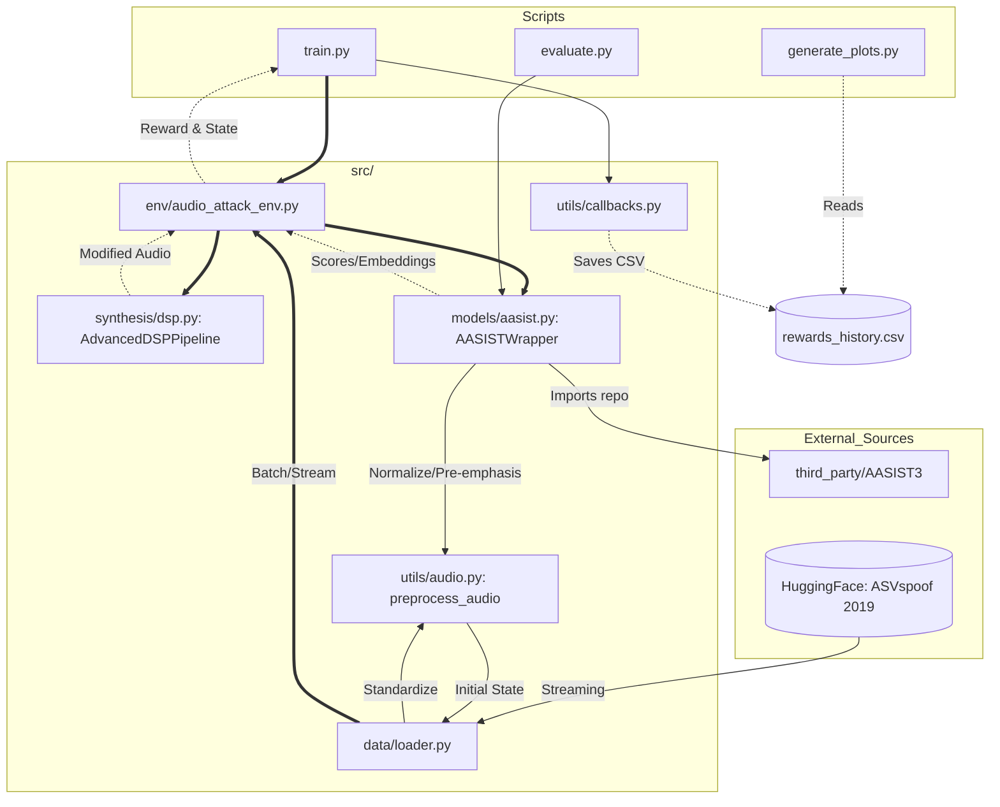

# KON-Artist: Kolmogorov-Arnold Obliterated Network

**KON-Artist** is an adversarial Reinforcement Learning (RL) framework designed to stress-test and bypass the **AASIST3** audio spoofing detection model. By leveraging the specific mathematical structures of Kolmogorov-Arnold Networks (KAN), this project aims to generate synthetic audio that exploits the decision boundaries of spline-based neural architectures.

---

## Project Overview

Current state-of-the-art detectors like AASIST3 rely on KAN layers for feature transformation and Graph Attention Networks (GAT) for temporal/spatial modeling. While KANs offer superior function approximation, they may introduce unique adversarial vulnerabilities due to their reliance on learnable activation functions (splines) on edges rather than fixed activations on nodes.

**KON-Artist** treats AASIST3 as a "frozen" critic within an RL environment. An agent (the Generator) learns to manipulate audio synthesis parameters to maximize the probability of being classified as "bonafide" (human) while maintaining minimum audio quality standards.

### Repository Architecture and Logic Flow

The repository follows a modular design where the **Gymnasium Environment** acts as the central hub, mediating between the RL Agent (PPO), the DSP transformations, and the frozen detector (AASIST3).


---

## Directory Layout

```
kon_artist/
├── configs/                # YAML files for hyperparameters (RL, KAN grids, Audio)
├── data/                   # Symlinks to ASVspoof datasets
├── docs/                   # Papers & Reports
├── notebooks/              # Prototyping and visualization of splines/audio
├── scripts/                # Entry points for the CLI
│   ├── train.py            # Main training loop
│   ├── generate_plots.py   # Generates convergence graph
│   └── evaluate.py         # Testing against different detectors
├── src/                    # Core library
│   ├── agents/             # RL logic (PPO, SAC, or custom Actor-Critic)
│   ├── data/               # Data loader (AVSpoof 2019 LA)
│   ├── env/                # Gymnasium wrappers for AASIST3
│   ├── models/             # Generator (Actor) architecture (KAN-based or MLPs)
│   ├── synthesis/          # Audio manipulation (HiFi-GAN, DSP functions)
│   └── utils/              # Audio processing, logging, and metrics (MOS, SDR)
├── third_party/            # External repos (git submodule add ... AASIST3)
│   └── AASIST3/            # AASIST3 repo (cloned)
├── tests/                  # Unit tests for audio alignment and reward logic
├── requirements.txt        # Python dependencies
├── pyproject.toml          # For 'pip install -e .'
└── pytest.ini              # For 'pytest'
```

---

## Adversarial Architecture

The system operates as a closed-loop optimization process where the detector's confidence score serves as the primary reward signal.

### 1. The Actor (Adversarial Generator)
The actor is a policy network that controls a non-differentiable or black-box audio generation pipeline. It adjusts parameters such as:
* Spectral tilt and harmonic distribution.
* Jitter and shimmer levels.
* Latent embeddings in a pre-trained Vocoder (e.g., HiFi-GAN).

### 2. The Environment (AASIST3 Wrapper)
The environment takes the generated raw `.wav` file, ensures it meets the 16kHz mono requirement, and passes it through the target AASIST3 model.

---

## Why Target KAN?

Traditional detectors rely on **MLPs** with global activation functions (like ReLU), creating piecewise linear decision boundaries. **AASIST3** instead uses **Kolmogorov-Arnold Networks (KANs)**, replacing fixed-node activations with **edge-based learnable splines**. While more efficient, this architecture introduces three specific structural vulnerabilities:

* **Grid Sensitivity:** KANs represent functions as a sum of B-splines ($\phi(x) = w_b b(x) + w_s \text{spline}(x)$) tied to a **discrete grid of knots**. This local support creates "grid artifacts"—under-constrained regions where minimal acoustic perturbations trigger disproportionate shifts in the latent space.
* **Jagged Manifolds:** Unlike the flat boundaries of $Wx + b$ matrices, KAN boundaries are defined by spline curvature. This creates high-frequency **adversarial pockets** that an RL agent can exploit through stochastic exploration.
* **Topological Poisoning:** In AASIST3, KANs project features into a **Graph Attention Network (GAT)**. By "obliterating" the KAN projection, the agent poisons the graph topology, causing GAT to misalign frequency dependencies (Spatial Sabotage) and ignore synthetic temporal jitters (Temporal Sabotage).

---

## Critical Limitations & Risks

* **Reward Hacking:** Without a strong discriminator or a "Quality Constable" (like a MOS estimator), the RL agent will inevitably find a mathematical "blind spot" in AASIST3 that results in non-speech audio being classified as human.
* **Vanishing Gradients in RL:** Since the reward is derived from a high-dimensional audio output, the credit assignment problem is significant. High-variance gradients may lead to unstable training.
* **Overfitting:** A generator that "obliterates" AASIST3 may fail completely against a standard CNN or ResNet-based spoofing detector, indicating that the learned attacks are model-specific rather than generalizable.

---

## Installation & Prerequisites

To ensure compatibility between the **KAN** layers and the **AASIST3** backbone, a specific alignment of the PyTorch ecosystem is required. This project uses a "scorched earth" installation approach to prevent binary conflicts between `torchvision` and `torchaudio` often found in cloud environments like Google Colab.

### Environment Setup

Execute the following block to clone the target detector and configure the environment:

```bash
# Install the project source code
pip install -e .

# Clone target detector repository
git clone https://github.com/mtuciru/AASIST3.git third_party/AASIST3

# 1. Purge all potentially conflicting packages
pip uninstall -y torch torchvision torchaudio torchcodec datasets

# 2. Install the strictly aligned PyTorch ecosystem (CUDA 12.1)
pip install torch==2.5.1 torchvision==0.20.1 torchaudio==2.5.1 --index-url https://download.pytorch.org/whl/cu121

# 3. Install remaining dependencies, pinning datasets to the stable 2.x branch
pip install transformers accelerate datasets==2.19.1 soundfile
```

> **Note:** The specific pinning of `datasets==2.19.1` is critical to maintain compatibility with the data loading scripts used in the ASVspoof 2024 pipeline.

-----

## References & Resources

The theoretical foundation of **KON-Artist** is built upon the following research papers and implementations:

### Research Papers

  * **AASIST3 (Target Model):** Borodin, K., et al. (2024). *AASIST3: KAN-enhanced AASIST speech deepfake detection using SSL features and additional regularization for the ASVspoof 2024 Challenge.* [arXiv:2408.17352](https://arxiv.org/abs/2408.17352)

  * **KAN (Foundational Architecture):** Liu, Z., et al. (2024). *KAN: Kolmogorov-Arnold Networks.* [arXiv:2404.19756](https://arxiv.org/abs/2404.19756)

### Repository & Weights

  * **Hugging Face Model Hub:** [MTUCI/AASIST3](https://huggingface.co/MTUCI/AASIST3)
  * **Official Implementation:** [mtuciru/AASIST3](https://www.google.com/search?q=https://github.com/mtuciru/AASIST3)

