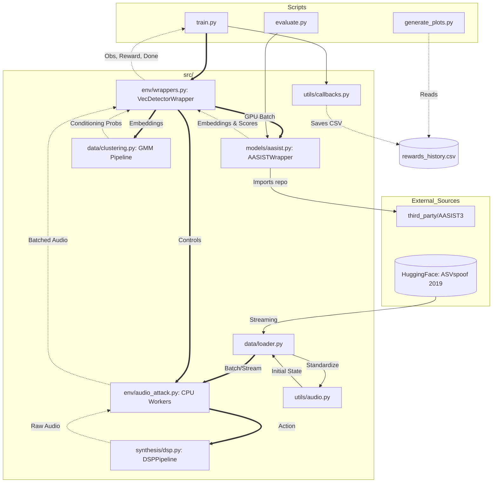

# KON-Artist: Kolmogorov-Arnold Obliterated Network

**KON-Artist** is an adversarial Reinforcement Learning (RL) framework designed to stress-test and bypass the **AASIST3** audio spoofing detection model. By leveraging the specific mathematical structures of Kolmogorov-Arnold Networks (KAN), this project aims to generate synthetic audio that exploits the decision boundaries of spline-based neural architectures.

---

## Project Overview

Current state-of-the-art detectors like AASIST3 rely on KAN layers for feature transformation and Graph Attention Networks (GAT) for temporal/spatial modeling. While KANs offer superior function approximation, they may introduce unique adversarial vulnerabilities due to their reliance on learnable activation functions (splines) on edges rather than fixed activations on nodes.

**KON-Artist** treats AASIST3 as a "frozen" critic within an RL environment. An agent (the Generator) learns to manipulate audio synthesis parameters to maximize the probability of being classified as "bonafide" (human) while maintaining minimum audio quality standards.

### Repository Architecture and Logic Flow

The repository follows a modular, scalable design structured for **Batched GPU Inference**. Instead of each worker environment holding a copy of the detector, **KON-Artist** uses a centralized `VecDetectorWrapper` to intercept raw audio from multiple CPU worker environments (`AudioAttackEnv`), batch them, and perform a single, highly efficient forward pass through the frozen detector (AASIST3).

Additionally, the state representation is enhanced by an **Acoustic Clustering Pipeline** (PCA + GMM) that appends soft cluster distributions to the AASIST3 embeddings, providing the agent with richer contextual conditioning.


---

## Directory Layout

```
kon_artist/
├── configs/                # YAML files for hyperparameters (RL, Audio, Clustering)
├── data/                   # Symlinks to ASVspoof datasets
├── docs/                   # Papers & Reports
├── notebooks/              # Prototyping and visualization of splines/audio
├── scripts/                # Entry points for the CLI
│   ├── train.py            # Main training loop
│   ├── generate_plots.py   # Generates convergence graph
│   └── evaluate.py         # EER/Inference Metrics
├── src/                    # Core library
│   ├── data/                 
│   │   ├── clustering.py   # PCA+GMM embedding clustering pipeline
│   │   └── loader.py       # Data loader (AVSpoof 2019 LA)
│   ├── env/                  
│   │   ├── audio_attack.py # Gymnasium worker environments
│   │   ├── reward_logic.py # Centralized reward calculations
│   │   └── wrappers.py     # VecDetectorWrapper for batched GPU inference
│   ├── models/aasist.py    # AASIST3 target model wrapper
│   ├── synthesis/dsp.py    # Audio manipulation (DSP pipeline)
│   └── utils/              # Audio processing, logging, and metrics
│       ├── audio.py        # Audio Preprocessing
│       ├── callbacks.py    # Reward Logging & W&B Integration
│       ├── metrics.py      # EER Calculations
│       ├── misc.py         # Utilities
│       └── logger.py       # Standardized Log-file Management
├── third_party/AASIST3/    # Target Model AASIST3 Repository (cloned)
├── tests/                  # Unit and integration tests
├── environment.yml         # Conda dependencies
├── pytest.ini              # Pytest configuration and warning filters
└── root.py                 # Project root anchor
```
---

## Adversarial Architecture

The system operates as a closed-loop optimization process where the detector's confidence score serves as the primary reward signal.

### 1. The Actor (Adversarial Generator)
The actor is a policy network that controls a non-differentiable or black-box audio generation pipeline. It adjusts parameters such as:
* Spectral tilt and harmonic distribution.
* Jitter and shimmer levels.
* Latent embeddings in a pre-trained Vocoder (e.g., HiFi-GAN).

### 2. The Critic (AASIST3 Wrapper)
The environment takes the generated raw `.wav` file, ensures it meets the 16kHz mono requirement, and passes it through the target AASIST3 model.

---

## Why Target KAN?

Traditional detectors rely on **MLPs** with global activation functions (like ReLU), creating piecewise linear decision boundaries. **AASIST3** instead uses **Kolmogorov-Arnold Networks (KANs)**, replacing fixed-node activations with **edge-based learnable splines**. While more efficient, this architecture introduces three specific structural vulnerabilities:

* **Grid Sensitivity:** KANs represent functions as a sum of B-splines ($\phi(x) = w_b b(x) + w_s \text{spline}(x)$) tied to a **discrete grid of knots**. This local support creates "grid artifacts"—under-constrained regions where minimal acoustic perturbations trigger disproportionate shifts in the latent space.
* **Jagged Manifolds:** Unlike the flat boundaries of $Wx + b$ matrices, KAN boundaries are defined by spline curvature. This creates high-frequency **adversarial pockets** that an RL agent can exploit through stochastic exploration.
* **Topological Poisoning:** In AASIST3, KANs project features into a **Graph Attention Network (GAT)**. By "obliterating" the KAN projection, the agent poisons the graph topology, causing GAT to misalign frequency dependencies (Spatial Sabotage) and ignore synthetic temporal jitters (Temporal Sabotage).

---

## Critical Limitations & Risks

* **Reward Hacking:** Without a strong discriminator or a "Quality Constable" (like a MOS estimator), the RL agent will inevitably find a mathematical "blind spot" in AASIST3 that results in non-speech audio being classified as human.
* **Vanishing Gradients in RL:** Since the reward is derived from a high-dimensional audio output, the credit assignment problem is significant. High-variance gradients may lead to unstable training.
* **Overfitting:** A generator that "obliterates" AASIST3 may fail completely against a standard CNN or ResNet-based spoofing detector, indicating that the learned attacks are model-specific rather than generalizable.

---

## Installation & Prerequisites

To ensure compatibility between the **KAN** layers and the **AASIST3** backbone, a specific alignment of the PyTorch ecosystem is required. This project uses a "scorched earth" installation approach to prevent binary conflicts between `torchvision` and `torchaudio` often found in cloud environments like Google Colab.

### Environment Setup

To ensure compatibility between the **KAN** layers and the **AASIST3** backbone, follow these steps to configure your local environment:

```bash
# Create the Conda environment
conda env create -f environment.yml

# Activate the environment
conda activate kon-env

# Clone target detector repository
git clone https://github.com/mtuciru/AASIST3.git third_party/AASIST3
```

> **Note:** The specific pinning of `datasets==2.19.1` is critical to maintain compatibility with the data loading scripts used in the ASVspoof 2024 pipeline.

## Execution

The project is structured as a Python package. Always run scripts from the project root using the module flag (`-m`) to ensure internal paths and the data ingestion system are resolved correctly.

### 1. Training the Agent
Execute the main training orchestrator to begin the PPO optimization loop. This logs rewards to `outputs/rewards_history.csv` and tracks DSP evolution via Weights & Biases.
```bash
python -m scripts.train
```

> In case you want to resume previous training, refer to this [guide](docs/guides/resume-training.md).

### 2. Performance Evaluation
Run the evaluation script to test the AASIST3 detector performance (EER) against specific datasets or to assess the success rate of the KON-Artist agent.
```bash
python -m scripts.evaluate
```

### 3. Generate Visualizations
Once training data is available, generate convergence plots and reward history graphs for reports. The script supports custom CSV paths, output locations, and smoothing windows.
```bash
# Standard usage
python -m scripts.generate_plots

# Custom usage
python -m scripts.generate_plots --csv outputs/history/rewards_custom.csv --out outputs/report_plot.png --window 100
```

### 4. Acoustic Clustering Pipeline
Before training with clustering conditioning, you must generate the GMM registry by analyzing the training dataset. This pipeline automatically optimizes the number of PCA components (targeting 95% variance) and GMM clusters (minimizing BIC).
```bash
python -m src.data.clustering
```
This generates:
* `models/gmm_registry.pkl`: The serialized pipeline for use in the RL environment.
* `outputs/plots/clustering_optimization.png`: Elbow plots for PCA and BIC scores.
* `outputs/plots/acoustic_clusters_tsne.png`: A 2D t-SNE visualization of the discovered manifolds.

-----

## References & Resources

The theoretical foundation of **KON-Artist** is built upon the following research papers and implementations:

### Research Papers

  * **AASIST3 (Target Model):** Borodin, K., et al. (2024). *AASIST3: KAN-enhanced AASIST speech deepfake detection using SSL features and additional regularization for the ASVspoof 2024 Challenge.* [arXiv:2408.17352](https://arxiv.org/abs/2408.17352)

  * **KAN (Foundational Architecture):** Liu, Z., et al. (2024). *KAN: Kolmogorov-Arnold Networks.* [arXiv:2404.19756](https://arxiv.org/abs/2404.19756)

### Repository & Weights

  * **Official Implementation:** [mtuciru/AASIST3](https://github.com/lab260ru/AASIST3)
  * **Hugging Face Model Weights:** [MTUCI/AASIST3](https://huggingface.co/MTUCI/AASIST3)
  * **Dataset AVSpoof 2019 LA:** [Bisher/ASVspoof_2019_LA](https://huggingface.co/datasets/Bisher/ASVspoof_2019_LA)

---

## Author

**Alejandro Lloveras** - *Lead Researcher & Developer* - [GitHub Profile](https://github.com/MLsound/)
